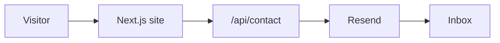

# Ch3rry Pi3 Website

Public marketing site for Ch3rry Pi3 AI Consulting.

## Live Site

https://www.ch3rry-pi3.com

## Overview

This repository contains the production website for the AI and machine learning consultancy, focused on fast performance, clear messaging, and a modern dark UI.

## Features

- Marketing pages: Home, Services, About, Contact
- Responsive navigation with mobile menu
- Contact form with server-side validation and Resend email delivery
- Anti-spam honeypot and basic validation on both client and server
- SEO metadata with canonical URLs (SITE_URL-aware)
- App Router architecture with server components by default

## Tech Stack

- Next.js (App Router)
- TypeScript
- Tailwind CSS
- Resend (transactional email delivery)
- Vercel (hosting and deployments)

## Architecture (high level)

## Documentation

Setup, deployment, and DNS details live in `guides/setup.md`.
