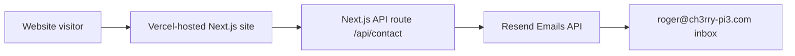

# Ch3rry-Pi3 Website Setup Guide (Next.js + Vercel + Resend)

This guide documents the end-to-end setup we just completed:

* Next.js (App Router) website
* Hosted on Vercel
* GitHub repo connected for auto-deployments
* Contact form that sends emails via Resend
* Human-check challenge + rate limiting + disposable email filtering
* Resend domain verification via GoDaddy DNS (DKIM + SPF + MX)
* Required environment variables for local dev and Vercel

## Prerequisites

### Accounts

* GitHub account (repo lives here)
* Vercel account (hosting)
* Resend account (email sending)
* Domain registrar / DNS provider access for `ch3rry-pi3.com` (GoDaddy in your case)

### Local tooling

* Node.js 18+ (recommended for modern Next.js)
* npm (bundled with Node.js)
* Git
* VS Code (optional, but assumed)

Quick checks:

```powershell
node -v
npm -v
git --version
```


## Architecture Overview

### High level



### Why this approach works well

* Vercel handles hosting, SSL, CDN, and deployments automatically
* Next.js API route avoids needing a separate backend for a simple contact form
* Resend is built for transactional email and plays nicely with serverless/edge deployments
* DNS verification ensures you can send from `roger@ch3rry-pi3.com` reliably (SPF + DKIM)


## 1) Create the Next.js project

From the folder where you keep your projects:

```powershell
npx create-next-app@latest ch3rry-pi3-site
```

Recommended selections (what you used):

* TypeScript: Yes
* ESLint: Yes
* Tailwind CSS: Yes
* App Router: Yes
* Use recommended defaults: Yes

Then:

```powershell
cd ch3rry-pi3-site
npm run dev
```

Visit:

* [http://localhost:3000](http://localhost:3000)


## 2) Create a GitHub repository and push the code

### Initialise git (if not already)

```powershell
git init
git add .
git commit -m "Initial Next.js site"
```

### Create repo on GitHub

Create a repo (personal or in an org), then add remote and push:

```powershell
git remote add origin https://github.com/<ORG_OR_USER>/<REPO>.git
git branch -M main
git push -u origin main
```

Notes:

* If using a GitHub organisation and you’re on Vercel Hobby, private org repos may be restricted. Public org repos work on Hobby (as you discovered).


## 3) Deploy the site on Vercel

### Install and login to Vercel CLI (optional)

```powershell
npm i -g vercel
vercel login
```

### Create Vercel project from your repo (recommended)

In Vercel dashboard:

1. Add New Project
2. Import Git Repository
3. Select your repo
4. Deploy

This gives you:

* a `*.vercel.app` URL immediately
* automatic builds on push


## 4) Ensure site is publicly accessible (Deployment Protection)

If your deployment required Vercel login:

1. Vercel → Project → Settings
2. Deployment Protection
3. Ensure **Vercel Authentication** is disabled for public access
4. Save


## 5) Connect Git to Vercel (auto-deployments)

When Git is connected:

* Every push to `main` triggers a Production deployment
* PRs trigger Preview deployments

You should see in:

* Vercel → Project → Settings → Git
* Connected repository listed


## 6) Set up Resend for sending email

### 6.1 Create Resend account

Sign up at Resend. Your signup email (e.g. `the_rfc@hotmail.co.uk`) does not prevent using a business sending domain later.

### 6.2 Create a Resend API key

Resend → **API Keys** → Create API key.

The API key:

* starts with `re_`
* is secret
* goes into environment variables

Important distinction:

* `re_...` = API key (secret)
* `p=MIIG...` = DKIM public key (not secret, lives in DNS, not used in code)


## 7) Verify your domain in Resend (DNS changes)

Goal: allow Resend to send from addresses like `roger@ch3rry-pi3.com`.

Resend → Domains → Add domain:

* `ch3rry-pi3.com`
* Choose region (you used Ireland / eu-west-1)

Resend then provides DNS records. In your case they were:

### 7.1 DKIM (TXT)

* Type: TXT
* Name: `resend._domainkey`
* Value: starts with `p=...` (long string)

### 7.2 SPF (TXT)

* Type: TXT
* Name: `send`
* Value: `v=spf1 include:amazonses.com ...` (exact value from Resend)

### 7.3 MX (MX)

* Type: MX
* Name: `send`
* Value: `feedback-smtp.eu-west-...` (exact value from Resend)
* Priority: `10`

Important: these records are scoped to the `send` subdomain for SPF/MX, so they do not break your existing Outlook/Microsoft 365 email (which uses an MX record on `@`).


## 8) Add the DNS records in GoDaddy

GoDaddy steps (what you did):

1. GoDaddy → Domains → `ch3rry-pi3.com`
2. DNS tab
3. Click **Add New Record**

### Add DKIM record

* Type: `TXT`
* Name: `resend._domainkey`
* Value: paste DKIM value from Resend
* TTL: default

Save.

### Add SPF record

* Type: `TXT`
* Name: `send`
* Value: paste SPF value from Resend
* TTL: default

Save.

### Add MX record

* Type: `MX`
* Name: `send`
* Value: paste MX value from Resend
* Priority: `10`
* TTL: default

Save.

Notes:

* Existing MX at host `@` pointing to Outlook is normal and should not be removed.
* Resend’s MX is for `send` subdomain and does not conflict.


## 9) Confirm verification in Resend

Back in Resend → Domains → `ch3rry-pi3.com`

You should see:

* Status: Verified
* DKIM: Verified
* SPF: Verified
* MX: Verified

Once verified, you can safely send from:

* `roger@ch3rry-pi3.com`


## 10) Implement the contact form API route (Next.js)

### Dependencies

Install Resend SDK:

```powershell
npm i resend
```

### API Route location (App Router)

Create or update:

* `app/api/contact/route.ts`

Expected behaviour:

* Accepts POST JSON
* Validates required fields (name, email, message)
* Honeypot spam field (e.g. `website`)
* Human-check challenge (captcha) with signed token
* Blocks disposable email domains
* Rate limits by IP and email address
* Sends email via Resend
* Returns `{ ok: true, id }` or `{ ok: false, error }`

Important implementation detail you hit:

* Your Resend SDK typings rejected `replyTo`
* Fix was to set Reply-To using `headers`

Example pattern:

```ts
headers: {
  "Reply-To": visitorEmail,
}
```


## 11) Frontend contact form (client-side)

Contact page should:

* Collect: name, email, company (optional), message
* Include hidden honeypot field: `website`
* Fetch and display a human-check question with a signed token
* Submit `captchaAnswer` and `captchaToken`
* POST to `/api/contact`
* Show success and error messages
* Disable submit while sending


## 12) Environment variables

You need env vars in two places:

* Local development: `.env.local`
* Vercel: Project Settings → Environment Variables

### 12.1 Local: `.env.local` (do not commit)

Create file in project root:

**`.env.local`**

```env
RESEND_API_KEY=re_XXXXXXXXXXXXXXXXXXXXXXXXXXXX
CONTACT_FORM_SECRET=replace_with_strong_secret
CONTACT_FROM_EMAIL=roger@ch3rry-pi3.com
CONTACT_TO_EMAIL=roger@ch3rry-pi3.com
NEXT_PUBLIC_SITE_URL=http://localhost:3000
```

Notes:

* `.env.local` is automatically ignored by git in a standard Next.js project.
* `CONTACT_FORM_SECRET` is optional. If unset, the API falls back to `RESEND_API_KEY` for signing the human-check token.
* `NEXT_PUBLIC_SITE_URL` is optional but helpful for canonical URLs and metadata.

### 12.2 Vercel Environment Variables

Vercel → Project → Settings → Environment Variables

Add these (All Environments):

* `RESEND_API_KEY` = `re_...` (your Resend API key)
* `CONTACT_FORM_SECRET` = strong random string (recommended)
* `CONTACT_FROM_EMAIL` = `roger@ch3rry-pi3.com`
* `CONTACT_TO_EMAIL` = `roger@ch3rry-pi3.com`

Optional:

* `NEXT_PUBLIC_SITE_URL` = `https://ch3rry-pi3.com` (once domain is connected to Vercel)

  * or your current `https://<project>.vercel.app`

Important:

* Updating env vars generally requires a new deployment to be picked up reliably.


## 13) Force a redeploy after env changes

### Option A: empty commit

```powershell
git commit --allow-empty -m "Refresh env vars"
git push
```

### Option B: Vercel UI

Vercel → Deployments → Redeploy latest


## 14) Test the contact form

### Local test

```powershell
npm run dev
```

Then submit the form at:

* [http://localhost:3000/contact](http://localhost:3000/contact)

### Curl test (local)

Fetch a human-check challenge first:

```powershell
curl http://localhost:3000/api/contact/challenge
```

Use the returned `question` to compute the answer, then submit the form with the `captchaToken`.

```powershell
curl -X POST http://localhost:3000/api/contact `
  -H "Content-Type: application/json" `
  -d '{"name":"Test User","email":"test@example.com","company":"ACME","message":"Hello from curl","website":"","captchaAnswer":"7","captchaToken":"REPLACE_WITH_TOKEN_FROM_CHALLENGE"}'
```

Expected response:

* `{"ok":true,"id":"..."}` or an error with `ok: false`

You should receive an email at:

* `roger@ch3rry-pi3.com`


## 15) Fix you encountered (Resend reply-to typing)

You saw this build error:

* `replyTo` does not exist in type `CreateEmailOptions`

Fix:
Use headers:

```ts
headers: {
  "Reply-To": result.data.email,
}
```

Then commit and redeploy.


## 16) SEO metadata (Next.js App Router)

Next.js supports:

* global metadata via `app/layout.tsx`
* per-page metadata via `export const metadata = { ... }` inside each `page.tsx`

Minimum recommended:

* title
* description
* Open Graph
* Twitter cards
* canonical URL / alternates (best once `NEXT_PUBLIC_SITE_URL` is set)

Suggested pattern:

* `app/layout.tsx` sets `metadataBase` using `NEXT_PUBLIC_SITE_URL` if available
* each page sets its own title/description

If Codex already added metadata, your task is:

* verify each page has correct title/description
* ensure canonical URLs use `NEXT_PUBLIC_SITE_URL` where possible


## 17) Checklist: “Done means done”

### Vercel

* Site publicly accessible
* Git connected
* Env vars set:

  * RESEND_API_KEY
  * CONTACT_FORM_SECRET
  * CONTACT_FROM_EMAIL
  * CONTACT_TO_EMAIL

### Resend

* Domain `ch3rry-pi3.com` verified
* DKIM/SPF/MX show verified

### Code

* `/api/contact` route exists and builds
* Contact form posts successfully
* Emails arrive in your inbox and “Reply” goes to the visitor


## Troubleshooting

### Build fails on Vercel

Go to Vercel → Deployments → Build Logs.
Common causes:

* TypeScript type mismatch (like `replyTo`)
* Missing env var referenced at build time

### Emails not sending

Check:

1. Vercel Runtime Logs for `/api/contact`
2. Resend Logs (Emails)
3. Confirm `RESEND_API_KEY` is present in Vercel

### Domain verified but FROM address rejected

Usually means you tried sending from an unverified sender.
Confirm:

* Resend domain shows Verified
* `CONTACT_FROM_EMAIL` is exactly `roger@ch3rry-pi3.com`


## Recommended repo files (optional, but useful)

### `.env.example` (safe to commit)

Create `.env.example`:

```env
RESEND_API_KEY=re_XXXXXXXXXXXXXXXXXXXXXXXXXXXX
CONTACT_FORM_SECRET=replace_with_strong_secret
CONTACT_FROM_EMAIL=roger@ch3rry-pi3.com
CONTACT_TO_EMAIL=roger@ch3rry-pi3.com
NEXT_PUBLIC_SITE_URL=https://ch3rry-pi3.com
```

This helps others know what variables are needed without exposing secrets.

